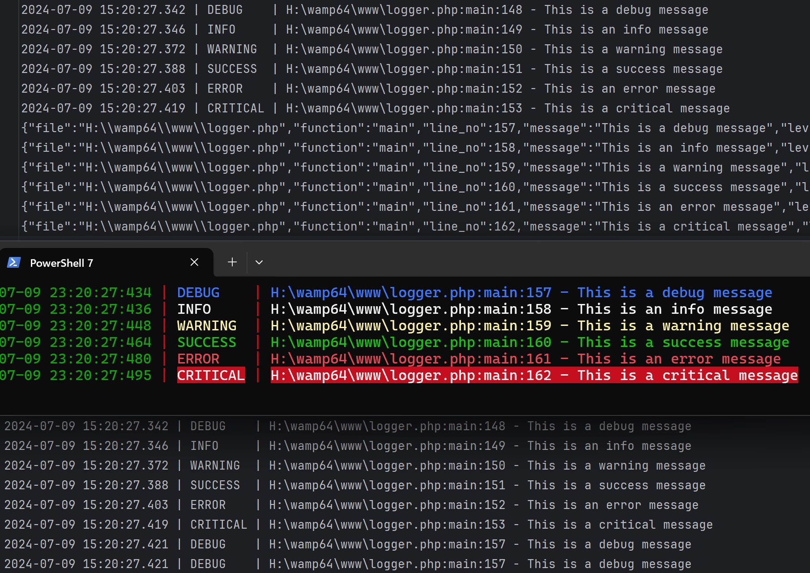

# php_debug_console

A simple way to log something to remote console.

一个简单的方法来记录程序日志

# 如何使用

将 `logger.php` 的 `Logger` 导入到项目中，配置回调路径和日志文件路径（可选）即可

如果不想使用回调记录，请保持地址为空，并设置 `Logger->stop_http_requests` 为大于今天的时间戳（可选）

使用 `Python` 运行 `debug_server.py` 来记录日志

# 示例

运行 `logger.php` 和 `debug_server.py` 即可看到效果

